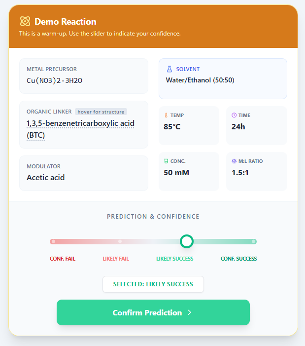

# MOF Quest

An expert benchmark for MOF synthesis prediction.

MOF Quest is an interactive research platform designed to quantify chemical intuition in metal-organic framework (MOF) synthesis. Participants are presented with literature-derived reaction conditions and asked to predict whether a crystalline MOF will form, together with their confidence level.

The platform was developed as part of the MOF Reactome project, which uses literature mining, negative-data reasoning, and machine learning to study MOF synthesizability and reaction outcome prediction.

<p align="center">
  
</p>


## Background

Synthetic chemistry advances through trial-and-error experimentation, yet failed experiments are rarely reported in the scientific literature. This creates a major challenge for data-driven materials discovery.

MOF Quest was developed to evaluate how experts predict synthesis outcomes and to compare these predictions against machine learning models trained on both successful and failed MOF synthesis experiments.

## Features

- 22 literature-derived MOF synthesis challenges
- Confidence-based predictions
- Expert benchmarking study
- Interactive linker structure visualization
- Randomized question order
- Automatic score calculation
- Google Sheets data collection
- Email reporting and analytics
- Research-ready participant statistics

## Benchmark Design

Each challenge includes:

- Metal precursor
- Organic linker
- Modulator
- Solvent
- Metal concentration
- Metal-to-linker ratio
- Temperature
- Reaction time

Participants classify each reaction as likely to succeed or fail and provide a confidence level for their prediction.

## Technology Stack

- React
- TypeScript
- Vite
- Tailwind CSS
- Google Apps Script
- Google Sheets
- Gemini API

## Run Locally

### Prerequisites

- Node.js

### Installation

Install dependencies:

```bash
npm install
```

Create `.env.local`:

```env
GEMINI_API_KEY=YOUR_API_KEY
```

Run locally:

```bash
npm run dev
```

Build for production:

```bash
npm run build
```

## Research Context

MOF Quest supports ongoing research on:

- Chemical intuition
- MOF synthesis prediction
- Negative-data learning
- Materials discovery
- Human expertise in synthesis planning
- AI-assisted chemistry

## Acknowledgements

This application was initially developed using Google AI Studio and Gemini models. We acknowledge Google AI Studio for rapid prototyping support during development.


© 2026 Zheng Research Group
